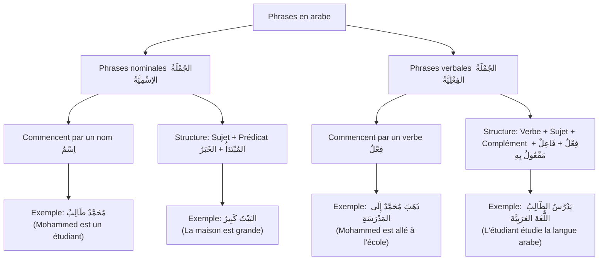
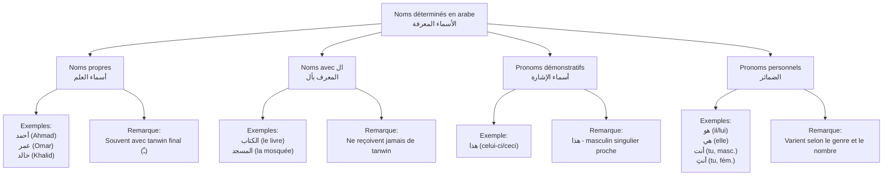

# Les phrases nominales - Leçon 1

## Introduction

Cette première leçon vous présente les fondements de la phrase nominale en arabe. Vous découvrirez comment construire des phrases simples en utilisant cette structure essentielle de la langue arabe.

## Objectifs d'apprentissage

À la fin de cette leçon, vous serez capable de :

- Comprendre la nature et la fonction d'une phrase nominale en arabe
- Construire des phrases simples suivant la structure sujet-attribut
- Formuler des questions élémentaires et y répondre correctement
- Maîtriser l'utilisation des noms déterminés
- Employer adéquatement le pronom de séparation

----

## Concepts fondamentaux

### La phrase nominale

En langue arabe, deux structures de phrases sont possibles : la phrase nominale et la phrase verbale. Cette leçon se concentre sur la phrase nominale, pierre angulaire de l'expression en arabe.

**Qu'est-ce qu'une phrase nominale ?**

Une phrase nominale est une structure qui commence par un nom. Elle repose sur deux éléments essentiels :

- le **moubtada** ([مُبْتَدَأ](/sounds/مُبْتَدَأ.mp3)) - le sujet, point de départ de la phrase
- le **khabar** ([خَبَر](/sounds/خَبَر.mp3)) - l'attribut, qui apporte l'information sur le sujet

**Règle fondamentale** : En arabe, même la phrase la plus simple doit obligatoirement comporter au moins ces deux éléments.

### Les noms déterminés

Principe essentiel : lorsque le moubtada occupe sa position initiale (en début de phrase), il doit nécessairement être déterminé.

Voici les quatre principales catégories de noms déterminés pouvant servir de moubtada :

#### 1. Les noms propres

Tels que [أَحْمَدٌ](/sounds/ahmed.mp3) ou [عُمَرٌ](/sounds/عُمَر.mp3). Un nom propre désigne une personne spécifique et est donc naturellement déterminé.
**Remarque importante** : Les noms propres masculins sont généralement marqués par une double voyelle (tanwin) finale : [أَحْمَدٌ](/sounds/ahmed.mp3) ، [عُمَرٌ](/sounds/عُمَر.mp3) ، [خَالِدٌ](/sounds/خَالِدٌ.mp3).

#### 2. Les mots précédés de [ال](/sounds/ال.mp3) (alif-lam)

Exemple : [الكِتَابُ جَدِيدٌ](/sounds/arabe-cours-001_001.mp3) (Le livre est nouveau)

**Point grammatical** : Un mot commençant par alif-lam ne peut jamais recevoir de tanwin (double voyelle) à sa terminaison.

#### 3. Les pronoms démonstratifs

Comme [هَذَا](/sounds/هَذَا.mp3) (celui-ci/ceci).

Exemple : [هَذَا بَيْتٌ](/sounds/arabe-cours-001_002.mp3) (Ceci est une maison)

**Précision d'usage** : Le démonstratif [هَذَا](/sounds/هَذَا.mp3) s'emploie uniquement pour désigner un élément masculin, singulier et proche du locuteur.

#### 4. Les pronoms personnels

Tel que [هُوَ](/sounds/هُوَ.mp3) (il/lui).

Exemple : [هُوَ بَابٌ](/sounds/arabe-cours-001_003.mp3) (C'est une porte)

### Les interrogations

Pour transformer une phrase affirmative en question, il suffit de la faire précéder par la particule هَلْ (équivalent à "est-ce que").

Exemple :

- [هَلْ هَذَا كِتَابٌ؟](/sounds/arabe-cours-001_004.mp3) (Est-ce que ceci est un livre ?)

**Point important** : Toute réponse à une question introduite par هَلْ commencera invariablement par نَعَم (oui) ou لا (non).

### Le pronom de séparation

Lorsque le moubtada et le khabar sont tous deux déterminés, un pronom de séparation doit être inséré entre eux.

Exemples :

- [هَذَا هُوَ الكِتَابُ](/sounds/arabe-cours-001_005.mp3) (Ceci est le livre)
- [المَسْجِدُ هُوَ البَيْتُ](/sounds/arabe-cours-001_006.mp3) (La mosquée est la maison)

Ce pronom de séparation, spécifique à la structure arabe, n'a pas d'équivalent direct en français et ne se traduit donc pas.

----

## Textes d'application

Voici des exemples concrets qui illustrent les concepts présentés dans cette leçon.

### Texte 1 : Le livre (الكِتَاب) [Play](/sounds/arabe-cours-001_007.mp3)

هَذَا كِتَابٌ. هَلْ هَذَا كِتَابٌ؟ نَعَم، هَذَا كِتَابٌ. هَلْ هَذَا بَابٌ؟ لا، هَذَا كِتَابٌ. هَذَا كِتَابٌ، هُوَ الكِتَابُ

**Traduction :**
Ceci est un livre.
Est-ce que ceci est un livre ?
Oui, ceci est un livre.
Est-ce que ceci est une porte ?
Non, ceci est un livre.
Ceci est un livre, c'est le livre.

**Concepts illustrés :** Construction d'une phrase nominale simple, formulation d'une question avec هَلْ, réponses affirmative et négative, utilisation du pronom de séparation.

### Texte 2 : La mosquée (المَسْجِد) [Play](/sounds/arabe-cours-001_008.mp3)

هَذَا مَسْجِدٌ. هَلْ هَذَا كِتَابٌ؟ لا، هَذَا مَسْجِدٌ. هَلْ هَذَا بَيْتٌ؟ لا، هَذَا مَسْجِدٌ. هَذَا مَسْجِدٌ. هَذَا هُوَ المَسْجِدُ.

**Traduction :**
Ceci est une mosquée.
Est-ce que ceci est un livre ?
Non, ceci est une mosquée.
Est-ce que ceci est une maison ?
Non, ceci est une mosquée.
Ceci est une mosquée.
Ceci est la mosquée.

**Concepts illustrés :** Expression de la négation, répétition du sujet pour renforcement, emploi du pronom de séparation.

### Texte 3 : La porte (البَاب) [Play](/sounds/arabe-cours-001_009.mp3)

هَذَا بَابٌ. هَلْ هَذَا مَسْجِدٌ؟ لا، هَذَا بَابٌ. هَلْ هَذَا بَابُ بَيْتٍ؟ نَعَم، هَذَا بَابُ بَيْتٍ. هَذَا بَابٌ، هُوَ البَابُ.

**Traduction :**
Ceci est une porte.
Est-ce que ceci est une mosquée ?
Non, ceci est une porte.
Est-ce que ceci est une porte de maison ?
Oui, ceci est une porte de maison.
Ceci est une porte, c'est la porte.

**Concepts illustrés :** Introduction à la construction possessive (بَابُ بَيْتٍ - porte de maison), distinction entre objets de même catégorie.

### Texte 4 : Omar (عُمَر) [Play](/sounds/arabe-cours-001_010.mp3)

هَذَا عُمَرٌ. هَلْ هَذَا عُمَرٌ؟ نَعَم، هَذَا عُمَرٌ. هَلْ عُمَرٌ صَحَابِيٌّ؟ نَعَم، عُمَرٌ صَحَابِيٌّ. عُمَرٌ هُوَ الصَّحَابِيُّ.

**Traduction :**
Ceci est Omar.
Est-ce que ceci est Omar ?
Oui, ceci est Omar.
Est-ce qu'Omar est un compagnon ?
Oui, Omar est un compagnon.
Omar est le compagnon.

**Concepts illustrés :** Utilisation d'un nom propre comme sujet, attribution d'une qualité ou d'une caractéristique à une personne.

----

## Vocabulaire

| Français | Arabe |
|----------|-------|
| Un livre | [كِتَابٌ](/sounds/كِتَابٌ.mp3) |
| Une mosquée | [مَسْجِدٌ](/sounds/مَسْجِدٌ.mp3) |
| Une porte | [بَابٌ](/sounds/بَابٌ.mp3)|
| Une maison | [بَيْتٌ](/sounds/بَيْتٌ.mp3)|
| Celui-ci, ceci | [هَذَا](/sounds/هَذَا.mp3)|
| Est-ce que |  [هَلْ](/sounds/هَلْ.mp3)|
| Oui | [نَعَم](/sounds/نَعَم.mp3)|
| Non |  [لا](/sounds/لا.mp3)|
| Nouveau | [جَدِيدٌ](/sounds/جَدِيدٌ.mp3)|
| Un compagnon | [صَحَابِيٌّ](/sounds/صَحَابِيٌّ.mp3)|
| Omar | [عُمَرٌ](/sounds/عُمَرٌ.mp3)|

----

## Points à retenir

1. La phrase nominale en arabe débute par un nom et s'articule autour d'un sujet (moubtada) et d'un attribut (khabar).
2. Le sujet doit impérativement être déterminé lorsqu'il occupe la position initiale de la phrase.
3. Pour formuler une question, il suffit d'ajouter la particule هَلْ au début de la phrase.
4. Les réponses s'introduisent systématiquement par نَعَم (oui) ou لا (non).
5. Lorsque le sujet et l'attribut sont tous deux déterminés, l'insertion d'un pronom de séparation entre eux devient nécessaire.
